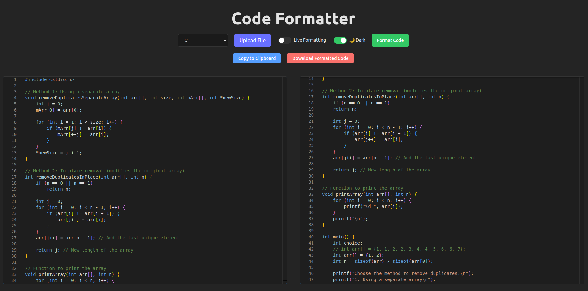

# Code Formatter Web App

A modern, responsive web application for formatting code in multiple programming languages, built with React, TypeScript, and Monaco Editor.



## Features

- **Multi-language Support**: Format code in JavaScript, TypeScript, Python, Java, C++, Kotlin, and many more languages
- **Real-time Formatting**: Toggle live formatting to see changes as you type
- **Code Upload**: Upload code files directly (.js, .ts, .py, .java, etc.)
- **Copy to Clipboard**: One-click copying of formatted code
- **Download Formatted Code**: Save your formatted code with proper file extension
- **Dark/Light Mode**: Theme toggle with system preference detection and localStorage persistence
- **Responsive Design**: Works on all screen sizes
- **Syntax Highlighting**: Powered by Monaco Editor (the same editor used in VS Code)

## How to Use

1. **Input Code**: Paste or type your code in the left editor panel, or upload a file
2. **Select Language**: Choose the appropriate programming language from the dropdown
3. **Format Code**: Click the "Format Code" button or enable "Live Formatting" for automatic updates
4. **Use Formatted Code**: Copy to clipboard or download the formatted file

## Technical Details

The application features:

- **Monaco Editor Integration**: Professional-grade code editing capabilities
- **Custom Formatting Logic**: Intelligently formats code with proper indentation (4 spaces)
- **Theme Persistence**: Saves user's theme preference in localStorage
- **File Type Validation**: Prevents uploading of unsupported file formats
- **Error Handling**: Clear error messages for user guidance

## Development

### Prerequisites

- Node.js 16+ and npm/yarn

### Setup

```bash
# Clone the repository
git clone https://github.com/yourusername/code-formatter-web-app.git

# Navigate to the project directory
cd code-formatter-web-app

# Install dependencies
npm install

# Start the development server
npm run dev
```

### Build for Production

```bash
npm run build
```

## License

This project is licensed under the MIT License - see the LICENSE file for details.

## Author

Samir Dubey

© 2025 Samir Dubey. All rights reserved.
